<picture>
  <source media="(prefers-color-scheme: dark)" srcset="./generated/profile-dark.svg">
  <source media="(prefers-color-scheme: light)" srcset="./generated/profile-light.svg">
  
</picture>

<!--
SETUP:
1. Rename this public repository so its name exactly matches your GitHub username.
2. Edit config.json and assets/portrait.txt.
3. Run the “Update profile dashboard” Action once, or wait for the schedule.
Full instructions: SETUP.md
-->
